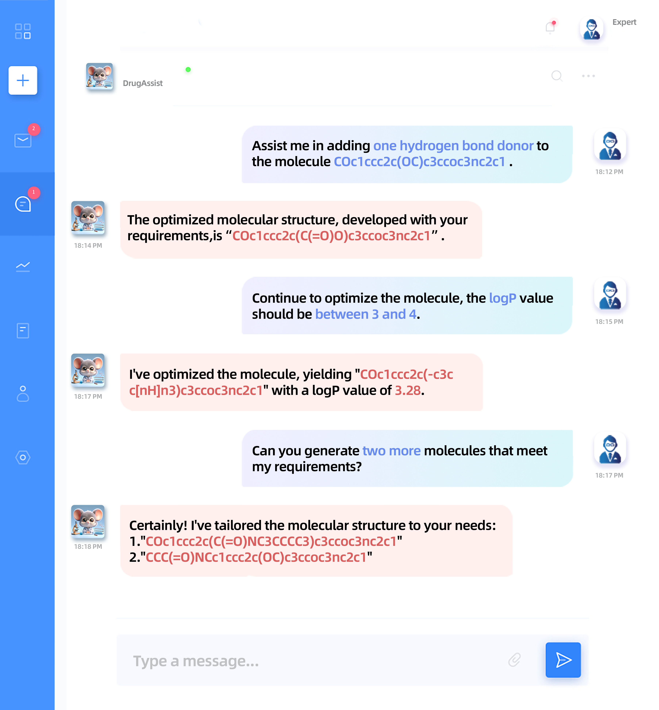

<h1 align="center"> 🐹 DrugAssist  </h1>
<h3 align="center"> A Large Language Model for Molecule Optimization </h3>

<p align="center">
  📃 <a href="https://arxiv.org/abs/2401.10334" target="_blank">Paper</a> • 🤗 <a href="https://huggingface.co/datasets/blazerye/MolOpt-Instructions" target="_blank">Dataset</a> • 🤗 <a href="https://huggingface.co/blazerye/DrugAssist-7B" target="_blank">Model</a><br>
</p>

<div align="center">
  
</div>

## 📌 Contents
- [Install](#install)
- [Dataset](#dataset)
- [Train](#train)
- [Demo](#demo)
- [About](#about)

## 🛠️ Install
1. Clone this repository and navigate to DrugAssist folder
```bash
git clone https://github.com/blazerye/DrugAssist.git
cd DrugAssist
```

2. Install Package
```Shell
conda create -n drugassist python=3.8 -y
conda activate drugassist
pip install -r requirements.txt
```

## 🤗 Dataset
We release the dataset on Hugging Face at [blazerye/MolOpt-Instructions](https://huggingface.co/datasets/blazerye/MolOpt-Instructions), and you can use it for training.

## 🚆 Train
You can use LoRA to finetune `Llama2-7B-Chat` model on the `MolOpt-Instructions` dataset, the running command is as follows:
```Shell
sh run_sft_lora.sh
```

## 👀 Demo
#### Step 1: Merge model weights
You can merge LoRA weights to generate full model weights using the following command:
```Shell
python merge_model.py \
    --base_model $BASE_MODEL_PATH \
    --lora_model $LORA_MODEL_PATH \
    --output_dir $OUTPUT_DIR \
    --output_type huggingface \
    --verbose
```
Alternatively, you can download our DrugAssist model weights from [blazerye/DrugAssist-7B](https://huggingface.co/blazerye/DrugAssist-7B).

#### Step 2: Launch web demo
You can use gradio to launch web demo by running the following command:
```Shell
python gradio_service.py \
    --base_model $FULL_MODEL_PATH \
    --ip $IP \
    --port $PORT
```
<div align="center">
  
</div>

## 📝 About
### Citation
If you find DrugAssist useful for your research and applications, please cite using this BibTeX:
```bibtex
@article{ye2023drugassist,
  title={DrugAssist: A Large Language Model for Molecule Optimization},
  author={Ye, Geyan and Cai, Xibao and Lai, Houtim and Wang, Xing and Huang, Junhong and Wang, Longyue and Liu, Wei and Zeng, Xiangxiang},
  journal={arXiv preprint arXiv:2401.10334},
  year={2023}
}
```
### Acknowledgements
We appreciate [LLaMA](https://github.com/facebookresearch/llama), [Chinese-LLaMA-Alpaca-2](https://github.com/ymcui/Chinese-LLaMA-Alpaca-2), [Alpaca](https://crfm.stanford.edu/2023/03/13/alpaca.html), [iDrug](https://drug.ai.tencent.com) and many other related works for their open-source contributions.