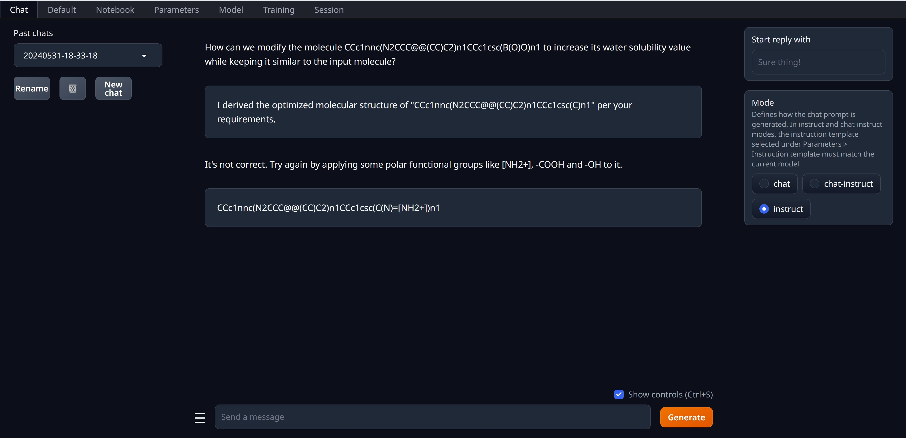

# Deploy the Quantized Model and Use Text-Generation-WebUI For Inference

Please follow these steps to deploy DrugAssist and perform inference using text-generation-webui.

## Step 1: Install Text-Generation-WebUI

Text-generation-webui currently supports Windows/Linux/macOS/WSL systems. For installation methods, please refer to the [webui installation](https://github.com/oobabooga/text-generation-webui?tab=readme-ov-file#how-to-install).

## Step 2: Download the Model Weights
To facilitate the deployment of DrugAssist on devices with lower hardware configurations (such as personal laptops without GPUs), we used [llama.cpp](https://github.com/ggerganov/llama.cpp) to perform 4-bit quantization on the [DrugAssist-7B](https://huggingface.co/blazerye/DrugAssist-7B) model, resulting in the [DrugAssist-7B-4bit](https://huggingface.co/blazerye/DrugAssist-7B/blob/main/DrugAssist-7B-4bit.gguf) model. Both models are publicly available on Hugging Face and you can choose one that suits your hardware configuration. After downloading, place the model weights in the `text-generation-webui-main/models` directory.

## Step 3: Launch WebUI

Run the `start_x.bat` in the `text-generation-webui-main` folder (choose `x` based on your operating system, e.g., on Windows, run `start_windows.bat`).

## Step 4: Load the Model and Modify the Parameters

1. In the webui's `Model` dropdown, select the model weights and click "load" to automatically load the model without manually configuring the loading parameters.
2. In the `Parameters-Instruction template` dropdown, select "Llama2-v2" as the instruction template for DrugAssist, and click "load" to load it.
3. After loading is complete, enter the following content in the `Custom system message` box: `You are now working as an excellent expert in chemistry and molecule discovery`.
4. You can also modify parameters such as temperature, top_k, top_p in `Parameters-Generation`.

## Step 5: Perform inference on WebUI

In the Mode section of the Chat column, click to select "instruct". After that, you can enter the prompt in the dialog box and click "generate" to chat with the model.

  

